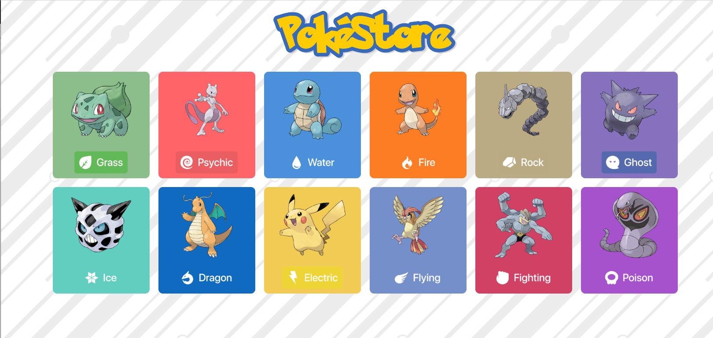
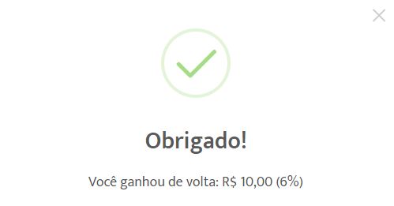

<p align=center>
  
</p>

<p align=center>   
  <strong>Uma loja virtual de Pokémon de diversos tipos pokémon.</strong>    
</p>
<p align=center>   
    <strong>Você pode acessar a loja em produção clicando diretamento <a href="https://poke-store.vercel.app/"</a>aqui.</strong>
</p>
<br>

<p align=center>
    
   
   
   
   
   
   
   
   
   
   
   
</p>

<p align="center">
  <a href="#page_with_curl-Sobre">Sobre</a>&nbsp;&nbsp;&nbsp;|&nbsp;&nbsp;&nbsp;
  <a href="#page_with_curl-Sobre">Base de Dados</a>&nbsp;&nbsp;&nbsp;|&nbsp;&nbsp;&nbsp;
  <a href="#wrench-Construido-com">Construído com</a>&nbsp;&nbsp;&nbsp;|&nbsp;&nbsp;&nbsp;
  <a href="#heart_eyes-Como-usar">Como usar</a>&nbsp;&nbsp;&nbsp;|&nbsp;&nbsp;&nbsp;
  <a href="#pencil-Autor">Autor</a>
</p>

## :page_with_curl: Sobre

A PokéStore é um projeto proposto para os candidatos no processo seletivo de uma empresa do ramo da tecnologia, com o objetivo de fazer a criação de uma loja virtual de Pokémon, tendo que escolher 2 tipos de Pokemons um para cada (água, fogo, grama, elétrico e etc) e para cada pokemon atribuir um valor.
Já participei desse processo seletivo no ano passado e afim de melhorar algumas coisas do projeto inclui outras tecnologias no projeto, juntamente com outros tipos de pokémon.

## Base de Dados

Os Pokémon devem ser buscados diretamente da api <a href="https://pokeapi.co/">Pokeapi</a>, nessa api eles nos permitem passar por parametro qual tipo de pokemon nos queremos trazer na busca. Como um fã de pokémon escolhi o tipo "Grama e Água", para quem assiste ou já assistiu todo mundo sabe que o Squirtle e o Bubassauro são os melhores pokémons né? haha brincadeiras a parte.

## MVP da aplicação

- Catálogo de produtos.
- Carrinho lateral.
- Resumo do carrinho.
- 12 lojas com estilos e tipos diferentes de Pokémon.
- Barra de busca para filtrar os Pokémon.
- Botão de finalizar compra, reiniciando o processo de compra.
- Modal de agradecimento ao finalizar compra.
- Salvar os dados da compra do usuário localmente para não perdê-las ao atualizar a página.

## :wrench: Construido com

- [ReactJS](https://pt-br.reactjs.org/)
- [Fecth](https://pt-br.reactjs.org/docs/faq-ajax.html/)
- [SweetAlert2](https://sweetalert2.github.io/)
- [CSS](https://developer.mozilla.org/pt-BR/docs/Web/CSS)
- [BootStrap](https://react-bootstrap.github.io/getting-started/introduction/)
- [React Icons](https://react-icons.github.io/react-icons/)
- [Material UI](https://material-ui.com/pt/)
- [React Toastify](https://www.npmjs.com/package/react-toastify/)


Também foram utilizados o eslint e prettier para estilização e formatação do código.
- [ESLint](https://github.com/eslint/eslint)
- [Prettier](https://github.com/prettier/prettier)

## Screens

- <h4>Home</h4>
<br>
<p align=center> 
  
</p>


## Modal ao finalizar a compra
- O "ganhou de volta" foi feito baseado no <a href="https://www.amedigital.com/">Ame</a>, coloquei para gerar a porcentagem de cashBack aleatóriamente).
<br>
<p align=center>
  
</p>

## Como utilizar

- <h4><strong>Para executar o projeto:</strong></h4>

1. Abra o terminal e digite:</br>

```
git clone <url-repositório>
```

2. Entre na pasta do projeto via terminal e digite:

```
npm install  ou  yarn install

```

3. Por último, execute a linha abaixo no terminal: 

```
yarn start 
```


## :pencil: Autor
<table>
  <tr>
    <td align="center"><a href="https://github.com/danielLeal98"><br /><sub><b>Daniel Leal</b></sub></a><br /></td>
  <tr>
</table>
